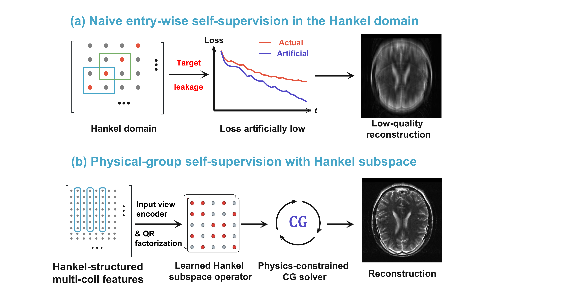
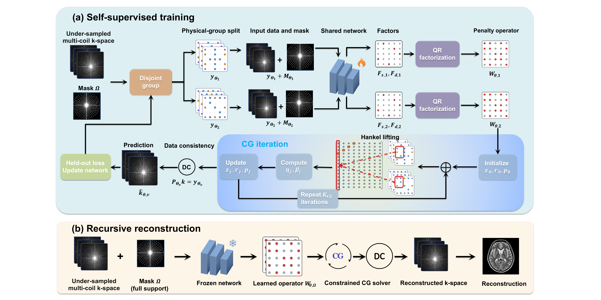
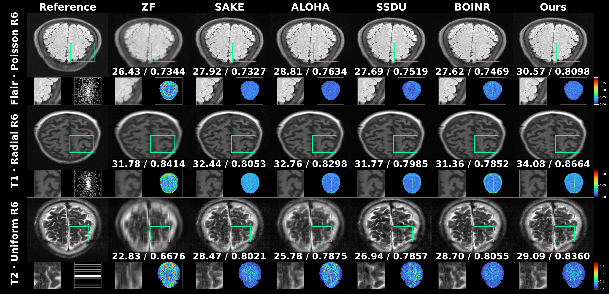
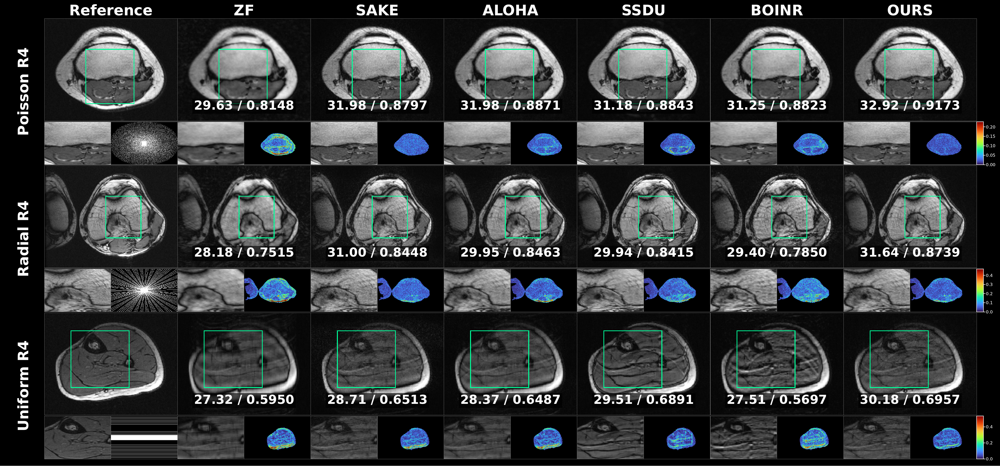

# HSSRecon

**Paper** Official PyTorch demo of *Hankel Subspace Self-Supervised Reconstruction for Parallel MRI*.

**Authors** Mingyu Hu, Siquan Zhu, Xijun Zhong, Qiegen Liu

- The paper is under review.

**Abstract** Parallel magnetic resonance imaging reconstruction is an
ill-posed inverse problem under undersampling. Multi-coil acquisition and
Hankel lifting expose complementary repeated information: observations of the
same anatomy across coils and repeated local k-space neighborhoods in
overlapping windows. These dependencies guide recovery of missing k-space
data. However, splitting lifted Hankel entries for self-supervision can place
the original sample in both input and target, causing data leakage. We propose
Hankel Subspace Self-Supervised Reconstruction (HSSRecon), a scan-specific
reconstruction framework for parallel magnetic resonance imaging. HSSRecon
partitions data by physical acquisition units before Hankel lifting and applies
multiplicity normalization to repeated Hankel copies in overlapping windows.
Rather than learning a black-box mapping that predicts missing data, the
network learns a compact complex-valued Hankel subspace operator.
Reconstruction is performed over the original k-space variables using a
conjugate-gradient solver with hard data consistency. This design separates
structural learning in the Hankel domain from data consistency in the physical
domain: the former exploits multi-coil and local Hankel correlations, while the
latter solves over unacquired degrees of freedom. We provide theoretical
analyses of physical-group splitting and multiplicity normalization, and
establish positive definiteness, uniqueness, hard data consistency, and a
finite-step conjugate-gradient error bound for the system. On fastMRI brain
data with three contrasts and three sampling masks, HSSRecon achieves
competitive peak signal-to-noise ratio, structural similarity, and normalized
mean squared error across six aggregated conditions. Ablations show that
physical-group splitting avoids leakage caused by Hankel-entry splitting,
while the learned subspace operator outperforms a matched fixed operator.

## The training and Inference of HSSRecon

[](image/fig-comparison-hankel-self-supervision.png) [](image/fig-hssrecon-pipeline.png)

The compact release uses zero-filled initialization and keeps SAKE only as an independent comparison baseline.

The bundled arrays are two fixed Poisson R6 fastMRI-brain visual examples. They contain derived RSS images and the mask, but not raw multi-coil k-space. To regenerate the montage:

```bash
python -m pip install -e ".[demo]"
python scripts/render_poisson_demo.py
```

The reconstruction runner accepts an external carrier NPZ with `kspace` and `mask`; the raw fastMRI carrier is not redistributed in this compact demo.
The fixed protocol is recorded in `configs/demo_poisson_r6.json`.

For a reconstruction run, provide a carrier NPZ with those two arrays:

```bash
python -m pip install -e ".[reconstruction]"
```

```bash
python scripts/run_hssrecon_demo.py \
  --input /path/to/case.npz \
  --output-root demo/outputs \
  --device auto
```

## Experimental Results

[](image/fig-fastmri-brain-main-comparison.png) [](image/fig-stanford-bone-main-comparison.png)

The figures above are the paper-reported qualitative and quantitative results. The current repository contains a demo only and does not regenerate the full paper figures.

This is a demo release. If the paper is accepted, the complete training and evaluation code will be uploaded.
